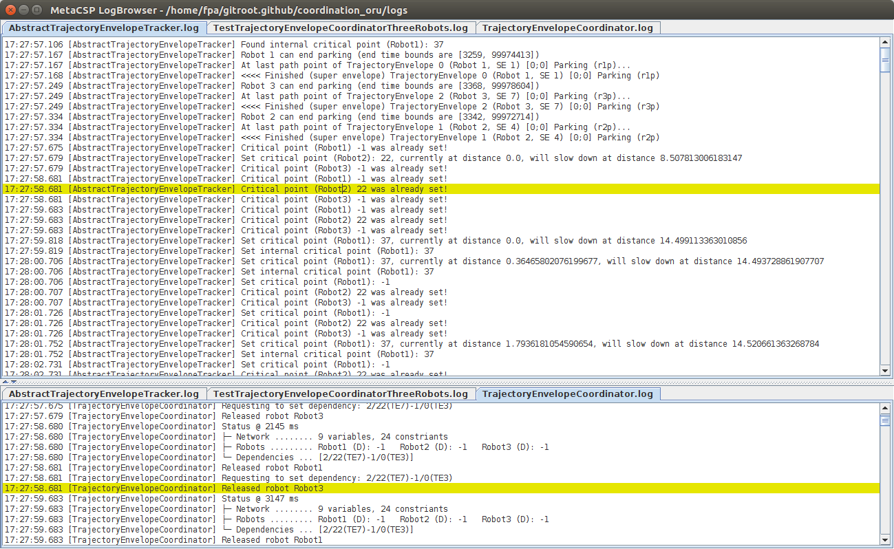

# coordination_oru
This package provides an online coordination method for multiple robots. It is based on the Meta-CSP Framework library available at <a href="http://metacsp.org">metacsp.org</a>. This package includes a basic 2D robot simulation, and does not require ROS or ROSJava. A plugin that enables the use of this package with the <a href="https://github.com/OrebroUniversity/navigation_oru-release">navigation_oru</a> package will be provided in the near future.

## Overview
The coordination method is based on the trajectory envelope representation provided by the Meta-CSP framework. A trajecotry envelope is a set of spatio-temporal constraints on a robot's trajectory. A trajecotry envelope spans over a path, which is itself a sequence of path poses ```<p1, ... pn>```. The method works as follows:

* For each pair of trajecotry envelopes (te1, te2) of two distinct robots, compute the areas of spatial intersection of the trajectory envelopes (critical sections)
* For each critical section such that the te1 has not yet been navigated through by the corresponding robot, instruct the robot driving te2 that it cannot drive beyond a critical point ```p``` defined as the maximum among
  * the first path point in the path of te1 that is also in the critical section
  * the path point of te2 that is ```s``` path points behind the current path point of the robot driving te1, where ```s``` is a safety distance

Critical sections are updated whenever a new mission is added, and critical points for each robot are updated at a specified control period (by default, 1000 msec).

## Installation
To install, clone this repository and compile the source code with gradle (redistributable included):

```
$ git clone https://github.com/FedericoPecora/coordination_oru.git
$ cd coordination_oru
$ ./gradlew install
```

## Running an example
To run an example, issue the following command from the source code root directory:
```
$ ./gradlew run
```
The example continuously posts missions for three robots to reach locations along intersecting paths. The paths are stored in files provided in the ```paths``` directory. The poses of locations and pointers to relevant path files between locations are stored in the self-explanatory ```paths/test_poses_and_path_data.txt``` file.

Running the above example opens a GUI showing the current state of the three robots.


A gray arrow between two robots indicates that the source robot will yield to the target robot. Priorities are computed every time a new mission is added. If multiple missions are added in batch, yielding behavior follows a fixed priority which can be specified programmatically. Driving robots always have priority over robots whose missions have been newly computed. The specific poses at which robots yield are computed on the fly based on the current positions of robots and the intersecting areas of their trajectory envelopes (critical sections). This makes it possible to achieve "following" behavior, that is, the yielding pose of a robot is updated online while the "leading" robot drives.

More detailed information is posted in the terminal. It can be inspected offline by running class ```coordination_oru.util.BrowseLogs```, which opens a log browsing GUI. The GUI shows a panel with the output of each thread that ran in the previous execution of the test program. Messages produced concurrently with the one at the current caret position are highlighted.


